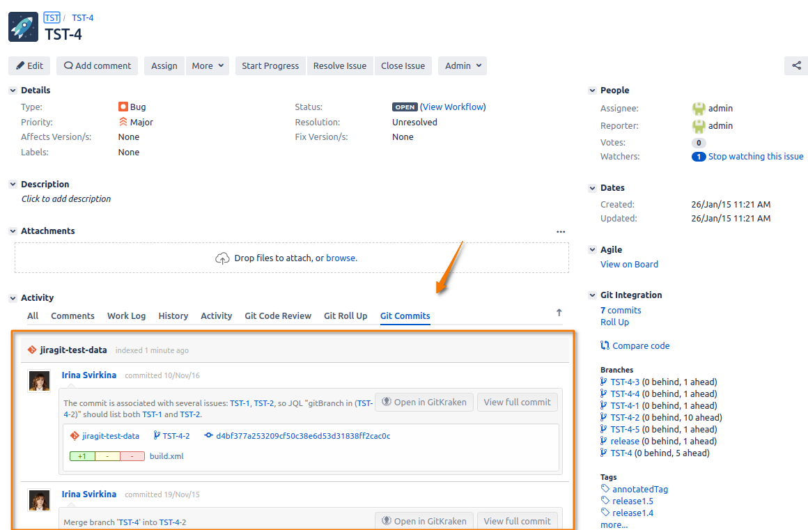
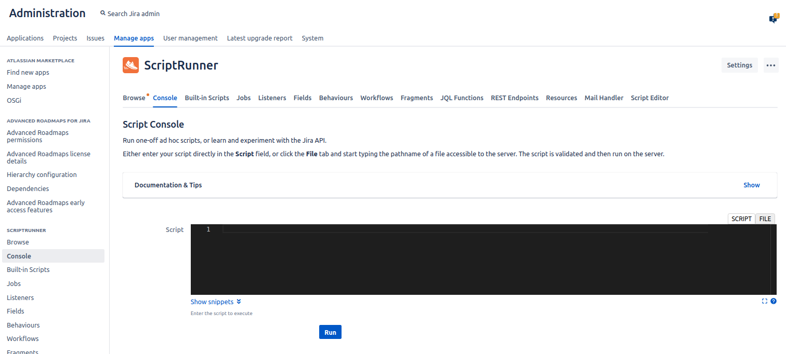
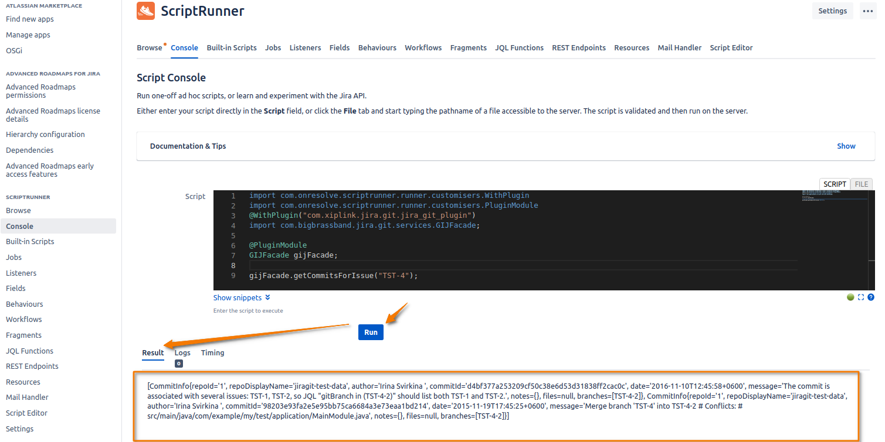
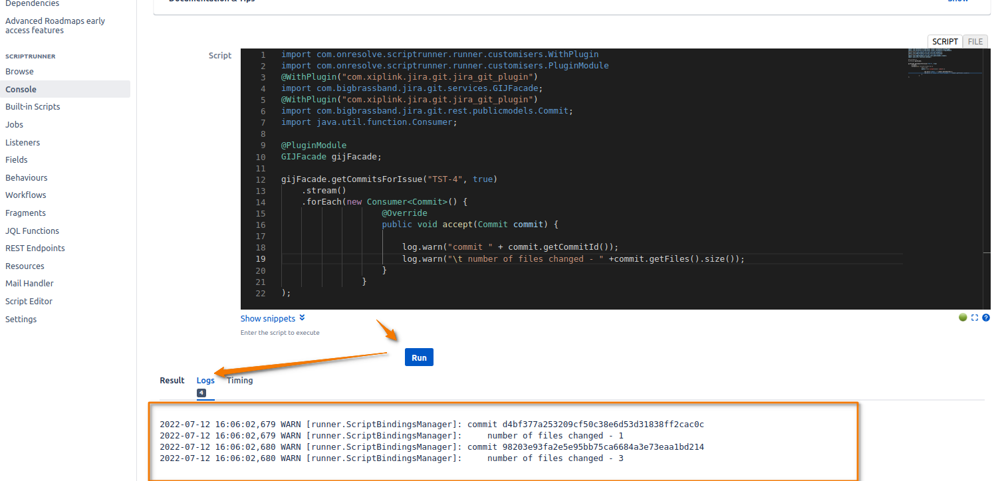
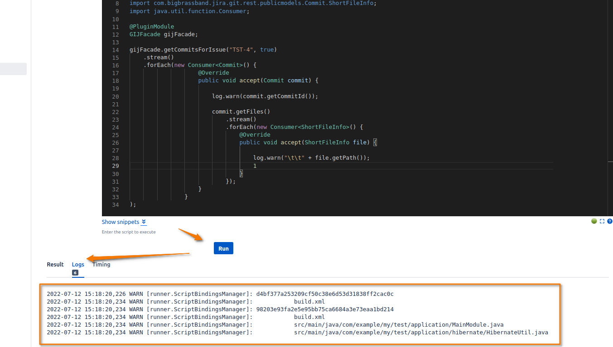
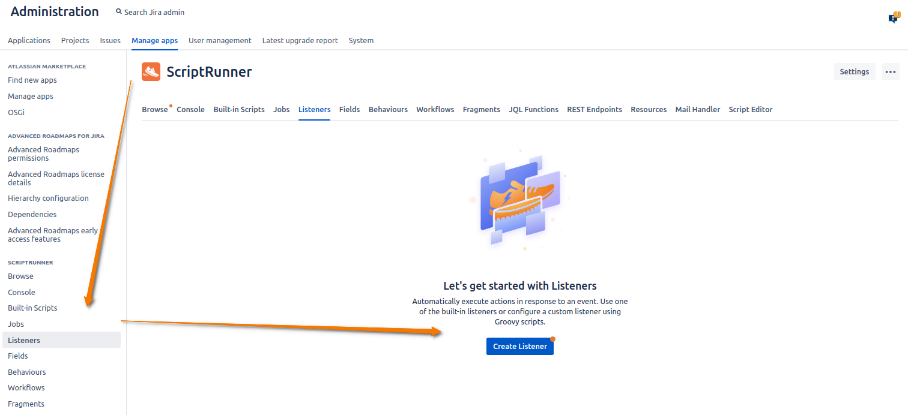
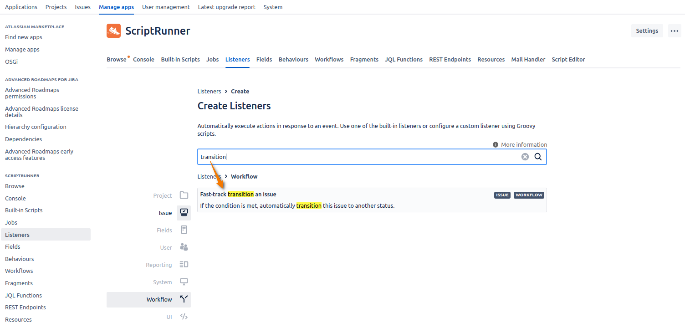
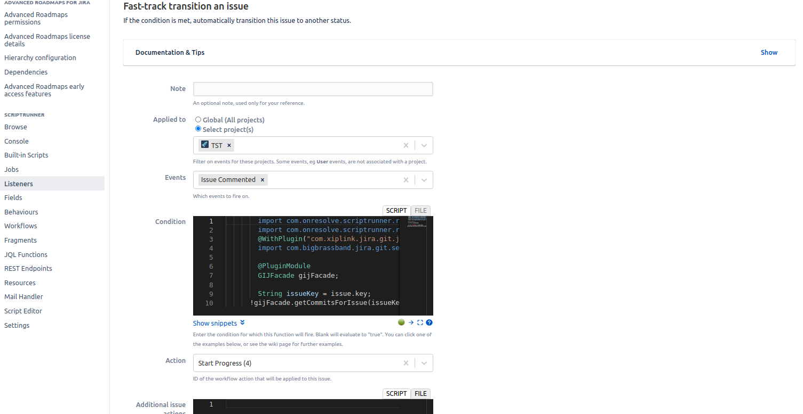

---

title: Git Integration + Scriptrunner
description: 
taxonomy:
    category: git-integration-for-jira-data-center

---

<br>

ScriptRunner for Jira Server is an app available on the Atlassian Marketplace that allows you to extend Jira functionality 
through the use of built-in and custom groovy scripts.

<br>

It provides administrators with an in-line editor where you can write groovy scripts. Such script can be scheduled as 
a job or to be run on an issue transition withing Jira workflows or etc.
Out-of-the-box, you can find several built-in scripts ready to go, or you may try some recipes to start using a bit of 
groovy for custom scripts.

## API available

Which API or functions can be used in such scripts? Adaptavist lists [the next ones](https://scriptrunner.adaptavist.com/latest/jira/behaviours-api-quickref.html).
<br>

Git Integration for Jira provides additional Java API ([GIJFacade interface](/git-integration-for-jira-self-managed/javadoc/com/bigbrassband/jira/git/services/GIJFacade.html))
allowing you to operate with git information. 
The API is close to [Git integration for Jira REST API](/git-integration-for-jira-self-managed/rest-api-gij-self-managed/)
and provides similar functionality (and more):
*   Repositories - get list of repositories connected, create/delete/update a repository

*   Integrations - get list of integrations connected, create/delete/update an integration

*   Reindex - start a reindex of repository/integration, check whether the reindex is finished 

*   Commits - get commits associated with an issue, change a commit issue association

*   Branches - get branches associated with an issue, create/delete branch

*   Tags - get tags associated with an issue

A singleton implementing [GIJFacade interface](/git-integration-for-jira-self-managed/javadoc/com/bigbrassband/jira/git/services/GIJFacade.html) is the main object having methods for all the above cases.
<br>
[JavaDocs](/git-integration-for-jira-self-managed/javadoc/) for all classes used in GIJFacade see [nearby](/git-integration-for-jira-self-managed/javadoc/).


## Examples of usage

Here might be numerous examples of scripts that couldn't be possible without existence of GIJFacade class. I will mention a few.

**Example 1**: 

The API allows you to write a script re-associating git commits from one issue to another.
Without such script, you have to click each git commit and manually re-assign it to another issue to be shown 
on Git Commits issue tab of another issue.

**Example 2**: 

Create a pull request if an issue has been moved to CODE REVIEW status. 


## Tutorial

Further I'll demonstrate several things:
* getting started with Scriptrunner plugin
* a creation of a simple script retrieving list of commits associated with issue "TST-4"
* a simple script logging number of files changed in each commit of issue "TST-4"
* a script listing files changed in each commit of issue "TST-4" 
* a setup of issue workflow in a such way that if an OPEN issue has at least one git commit then it's moved to IN PROGRESS status

## Getting started with Scriptrunner plugin

For Jira Server/Data Center, you will need to download and install Scriptrunner plugin from the Atlassian Marketplace.
None further GIJ configuration is required.

### Downloading the app

1.  Go to [Scriptrunner for Jira](https://marketplace.atlassian.com/apps/6820/scriptrunner-for-jira?tab=overview&hosting=cloud) and start the free trial or buy it now.

2.  Login to your Atlassian account when prompted and generate a new license for the trial.

3.  IMPORTANT Make sure to copy your license and save it.

4.  Click **Download** to download the app to your local system.

### Installing the app

<b style='color: #63B9CC'>REQUIRES ADMIN ACCESS</b>

1.  On your Jira Server/Data Center instance, navigate to Manage apps (Jira settings ➜ Manage apps ➜ **Manage apps**).

    .png?api=v2)

2.  Click **Upload app** and locate the downloaded A4J JAR file.

3.  After the installation, look under the User-installed apps and open the **Automation for Jira** tab.

4.  Paste the license key into the provided box then click **Update**.

## Example 1: How to create a simple script?

<b style='color: #63B9CC'>REQUIRES ADMIN ACCESS</b>

Precondition:
* GIJ plugin is installed.
* Some repository is connected.
* You have an issue (e.g. TST-4) having git commits associated with it on Git Commits issue tab.
  Otherwise script will return empty list.
  

Steps
* open Scriptrunner console (Jira settings ➜ Manage apps ➜ Scriptrunner **Console**).
  Here you can experiment with scripts, debug scripts, execute scripts.
  
* input the next code
```
import com.onresolve.scriptrunner.runner.customisers.WithPlugin
import com.onresolve.scriptrunner.runner.customisers.PluginModule
@WithPlugin("com.xiplink.jira.git.jira_git_plugin")
import com.bigbrassband.jira.git.services.GIJFacade;

@PluginModule
GIJFacade gijFacade;

gijFacade.getCommitsForIssue("TST-4");
```
* press "Run" button
  
* a result of the last operation is displayed at the bottom in "Result" tab.
  In our case the last operation is ```gijFacade.getCommitsForIssue("TST-4");``` so the tab displays a list of commits associated with issue "TST-4.
  <br>
  Please be aware that just brief objects information is logged by default, i.e. each commit object in the list contains much more information about a commit 
  which can be gotten programmatically. See [Commit](/git-integration-for-jira-self-managed/javadoc/com/bigbrassband/jira/git/rest/publicmodels/Commit.html.md) class javadocs to find a full list of information provided.
  
## Example 2: How to log?
* pay your attention to "Logs" tab at the bottom. There can be many logs while a result is only one.
  <br>
  Use ```log.warn("Your message")``` to log something.
  <br>
* Let's log commits and number of changed files. Enter the next script in Scriptrunner console and run
  ```
  import com.onresolve.scriptrunner.runner.customisers.WithPlugin
  import com.onresolve.scriptrunner.runner.customisers.PluginModule
  @WithPlugin("com.xiplink.jira.git.jira_git_plugin")
  import com.bigbrassband.jira.git.services.GIJFacade;
  @WithPlugin("com.xiplink.jira.git.jira_git_plugin")
  import com.bigbrassband.jira.git.rest.publicmodels.Commit;
  import java.util.function.Consumer;
  
  @PluginModule
  GIJFacade gijFacade;
  
  gijFacade.getCommitsForIssue("TST-4", true)
      .stream()
      .forEach(new Consumer<Commit>() {
          @Override
          public void accept(Commit commit) {
  
              log.warn("commit " + commit.getCommitId());
              log.warn("\t number of files changed - " +commit.getFiles().size());
          }
      }
  );
   ```
* Click "Run" button
* Switch to "Logs" tab
  

## Example 3: How to log more than a brief information?
* As it mentioned above, a commit is logged using brief information by default.
  For example files are not logged but are present in commit objects when you retrieve them with help of ```gijFacade.getCommitsForIssue("TST-4", true)```.
  <br>
  Let's look at  [Commit](/git-integration-for-jira-self-managed/javadoc/com/bigbrassband/jira/git/rest/publicmodels/Commit.html.md) javadocs and log commits with files in a beautiful way. Enter the next script in Scriptrunner console and run
  ```
  import com.onresolve.scriptrunner.runner.customisers.WithPlugin
  import com.onresolve.scriptrunner.runner.customisers.PluginModule
  @WithPlugin("com.xiplink.jira.git.jira_git_plugin")
  import com.bigbrassband.jira.git.services.GIJFacade;
  @WithPlugin("com.xiplink.jira.git.jira_git_plugin")
  import com.bigbrassband.jira.git.rest.publicmodels.Commit;
  @WithPlugin("com.xiplink.jira.git.jira_git_plugin")
  import com.bigbrassband.jira.git.rest.publicmodels.Commit.ShortFileInfo;
  import java.util.function.Consumer;
  
  @PluginModule
  GIJFacade gijFacade;
  
  gijFacade.getCommitsForIssue("TST-4", true)
      .stream()
      .forEach(new Consumer<Commit>() {
          @Override
          public void accept(Commit commit) {
  
              log.warn(commit.getCommitId());
  
              commit.getFiles()
                  .stream()
                  .forEach(new Consumer<ShortFileInfo>() {
                      @Override
                      public void accept(ShortFileInfo file) {
  
                          log.warn("\t\t" + file.getPath());
  
                      }
                  });
          }
      }
  );
  ```
* Switch to "Logs" tab. Here you can see commits with files.
  
* Great, we got it.
* How it works? Look, how the original script was changed:
  * we had to add more imports to avoid compilation error
  * we called ```gijFacade.getCommitsForIssue("TST-4", true)``` instead of ```gijFacade.getCommitsForIssue("TST-4")``` otherwise list of files is null
  * we looped throughout commits
    ```
      gijFacade.getCommitsForIssue("TST-4", true)
          .stream()
          .forEach(new Consumer<Commit>() {
              @Override
              public void accept(Commit commit) {
      
                  log.warn(commit.getCommitId());
                  ...
              }
          }
    );
    ```
  * and then looped throughout files belonging to each commit
    ```
             ...
                commit.getFiles()
                  .stream()
                  .forEach(new Consumer<ShortFileInfo>() {
                      @Override
                      public void accept(ShortFileInfo file) {

                          log.warn("\t\t" + file.getPath());

                      }
                  });
             ...
    ```
    
## Example 4: Move an issue in IN PROGRESS status when at least one git commit exists

* Let's write and debug a code detecting whether an issue has at least one git commit
* * open Scriptrunner console (Jira settings ➜ Manage apps ➜ Scriptrunner **Console**).
* * input the next code
```
import com.onresolve.scriptrunner.runner.customisers.WithPlugin
import com.onresolve.scriptrunner.runner.customisers.PluginModule
@WithPlugin("com.xiplink.jira.git.jira_git_plugin")
import com.bigbrassband.jira.git.services.GIJFacade;

@PluginModule
GIJFacade gijFacade;

String issueKey = "TST-4";
!gijFacade.getCommitsForIssue(issueKey).isEmpty();
```
* * press "Run" button
* * open "Result" tab. Result: "true".
* * When I change issueKey variable value to another (e.g. ```String issueKey = "TST-3";```) then the code returns whether TST-3 has git commits or not. Good
* How to integrate the code into workflow? How to customize it by dynamic IN issueKey parameter? 
  <br>
  Below I'll show an example which is not smart enough, but which demonstrates a principe of using gijFacade in Scriptrunner features.
* Let's create a Scriptrunner Listener which will be triggered by an adding a comment to an issue. If the issue has git commits then the listener will move the issue to IN PROGRESS status.
* * Open Scriptrunner Listeners (Jira settings ➜ Manage apps ➜ Scriptrunner **Listeners**).
  
* * Click "Create Listener" 
* * Find and choose "Fast-track transition an issue"
    
* * Set up the new listener
    
* * Set Event = "Issue Commented"
* * Input the next script into Condition. It's our script but customized a bit, e.g. it uses ```String issueKey = issue.key;```
```
import com.onresolve.scriptrunner.runner.customisers.WithPlugin
import com.onresolve.scriptrunner.runner.customisers.PluginModule
@WithPlugin("com.xiplink.jira.git.jira_git_plugin")
import com.bigbrassband.jira.git.services.GIJFacade;

@PluginModule
GIJFacade gijFacade;

String issueKey = issue.key;
!gijFacade.getCommitsForIssue(issueKey).isEmpty();
```
* * Choose Action = "Start Progress"
* * Transition Options: tick on "Skip Permissions", "Skip Validators", "Skip Conditions" just in case
* * Click "Add" button
* Let's test it.
* * Open TST-4 issue, which is in OPEN status and which has git commits associated.
* * Add comment "Some comment." Result: the issue is in status IN PROGRESS, because it has git commits. Great. We got it.

## Permissions

Permissions model is provided by Scriptrunner. So read its documentation.

## Known issue

...

## Advanced Examples

For advanced examples, see sub-page [Automation Advanced Examples](https://bigbrassband.atlassian.net/wiki/spaces/GITCLOUD/pages/1714257921).

## More related topics about Scriptrunner

*   [A4J advanced examples](/git-integration-for-jira-self-managed/Git-integration-plus-Jira-automation-advanced-examples-gij-self-managed/)

*   [A4J library templates](/git-integration-for-jira-self-managed/Git-Integration-for-Jira-automation-template-library/)

